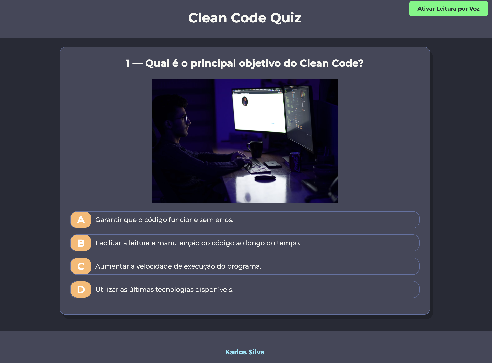
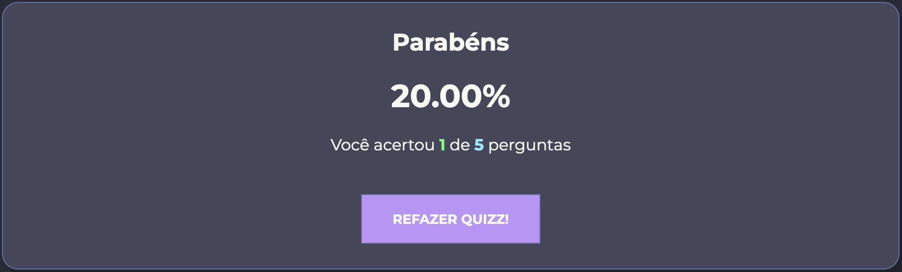

# 🎯 Programming Quiz

Welcome to the **Programming Quiz** project! This is an interactive quiz game designed to test your knowledge about **Clean Code** practices. The app dynamically displays questions and allows the user to hear the questions and answers read aloud with the click of a button. Built with pure HTML, CSS, and JavaScript.
This project was developed for an experiment at the College of Software Engineering


## 🌟 Features

- 📝 A set of questions about **Clean Code** principles.
- 🎤 **Text-to-speech** functionality, allowing the quiz to be read aloud.
- 💯 Displays the final score with the number of correct answers.
- 🔄 Option to restart the quiz after completion.

## 🚀 Live Preview

You can check out the live version of the project hosted on GitHub Pages:

[🔗 **Live Preview**](https://karlos-silva.github.io/quiz-js/)

## 📸 Screenshots

Here are some screenshots of the application:

### Quiz Interface


### Final Score


## 💻 Technologies Used

- **HTML5**: For the structure of the web pages.
- **CSS3**: For styling and layout.
- **JavaScript**: For handling the quiz logic and the text-to-speech functionality.
- **GitHub Pages**: To host the project.

## 🛠️ How to Run the Project Locally

To run the project on your local machine, follow these steps:

1. Clone the repository:
  ```bash
  git clone https://github.com/your-username/quiz-project.git
   ```
2. Navigate to the project directory:
  ```bash
  cd quiz-js
   ```
3. Open the `index.html` file in your browser:

On Windows: Right-click on the file and select **Open with** -> Your Browser.
On Mac: Use **Cmd + O** and select the file.
Alternatively, you can use a local server to serve the files.

## 🎨 Customization
Feel free to customize the following parts of the project:

Questions: Add or modify the questions in the scripts.js file under the questionsList array.
Images: Replace or add images for each question by modifying the image property in the questionsList array.
🤝 Contributing
If you'd like to contribute to this project, please feel free to fork the repository and submit a pull request. Any improvements or bug fixes are welcome!

## 📄 License
This project is open-source and available under the MIT License.

Made with ❤️ by Your Karlos
